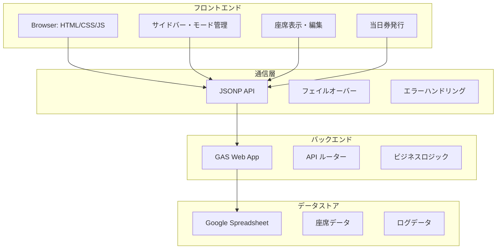
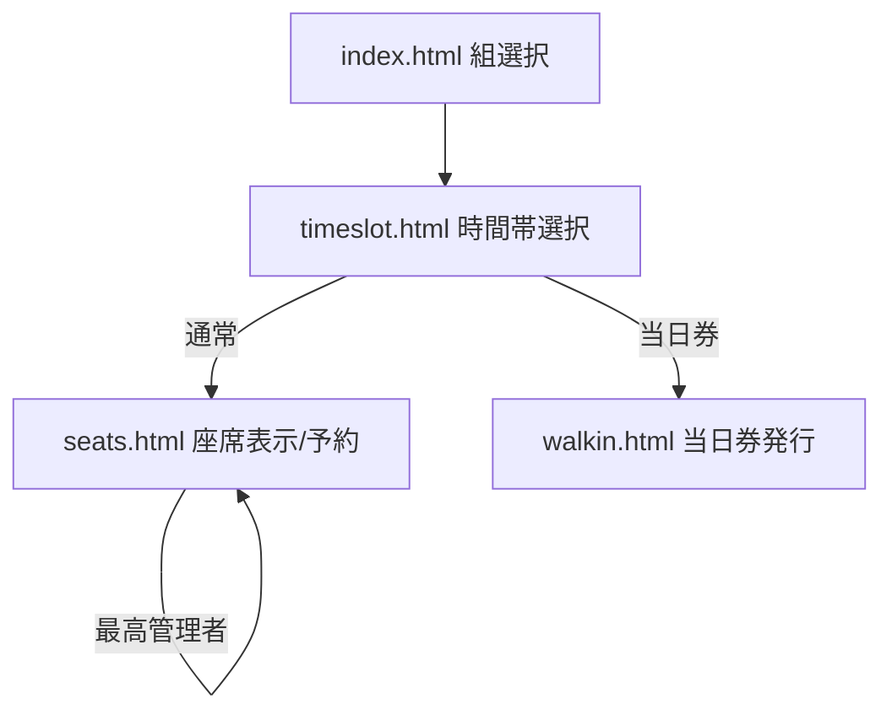
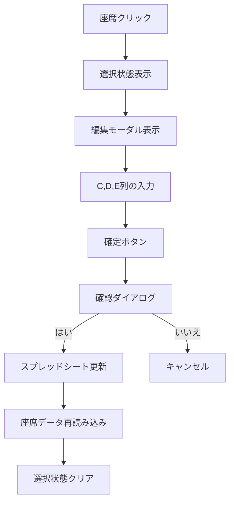
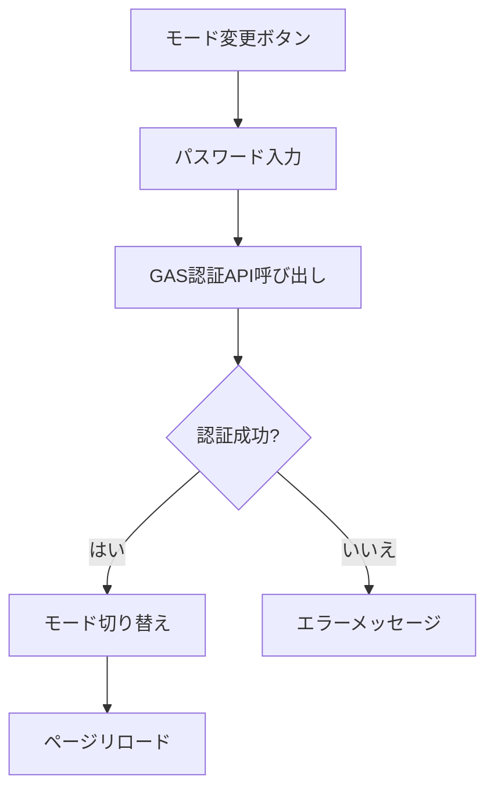
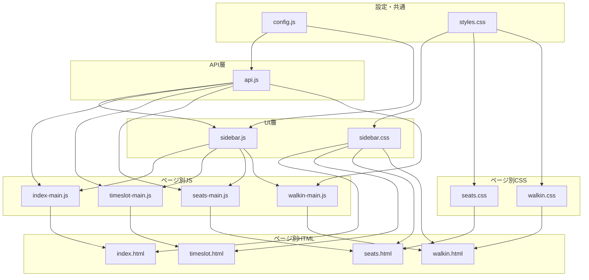
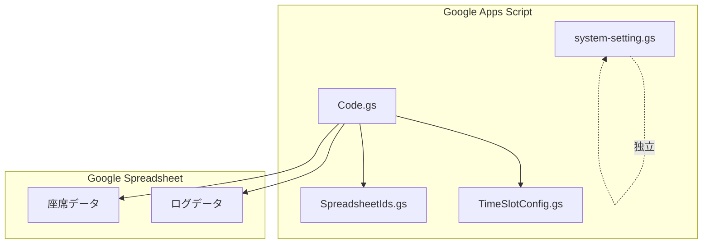
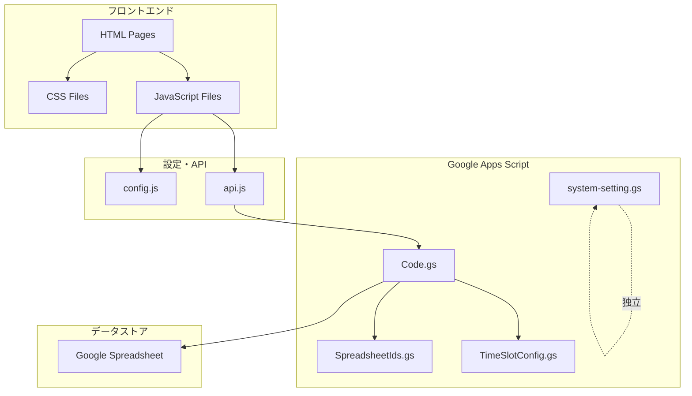
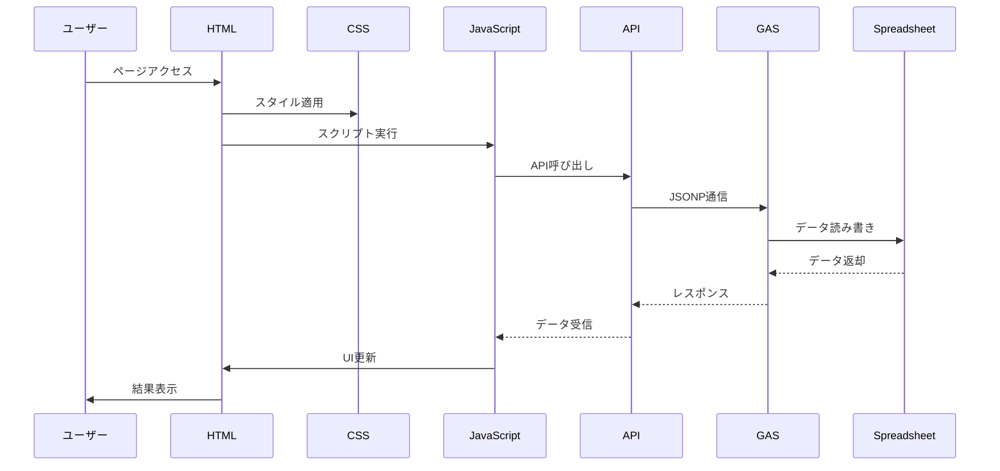

# チケット管理システム

文化祭やイベント向けの座席予約・チェックイン・当日券発行・最高管理者機能を行うシンプルな Web クライアントと、Google Apps Script（GAS）で構築されたバックエンドからなるシステムです。静的ホスティング可能なフロントエンド（HTML/CSS/JS）と、スプレッドシートをバックエンドとして使う運用に最適です。

## 📋 目次

- [🚀 主な機能](#-主な機能)
- [🏗️ システム構成](#️-システム構成)
- [🎯 動作モード](#-動作モード)
- [📱 画面構成](#-画面構成)
- [🔐 最高管理者モード](#-最高管理者モード)
- [🎫 当日券機能](#-当日券機能)
- [⚙️ セットアップ手順](#️-セットアップ手順)
- [🎮 使い方](#-使い方)
- [🔧 設定とカスタマイズ](#-設定とカスタマイズ)
- [🛡️ セキュリティ](#️-セキュリティ)
- [📊 アーキテクチャ](#-アーキテクチャ)
- [🔄 技術仕様](#-技術仕様)
- [📁 ファイル構成](#-ファイル構成)
- [🚨 トラブルシューティング](#-トラブルシューティング)
- [📚 使用例](#-使用例)
- [🔮 今後の拡張予定](#-今後の拡張予定)

---

## 🚀 主な機能

### 基本機能
- **座席可視化と予約**（通常モード）
- **予約済/確保/チェックイン待ち/チェックイン済のステータス表示**
- **自動更新**（座席マップの定期リフレッシュ）と手動更新

### 管理者機能
- **管理者モード**：予約済/確保席の複数席同時チェックイン
- **当日券モード**：空席の自動割当（1〜6枚）
- **最高管理者モード**：座席データのC、D、E列を自由に編集可能

### モード管理
- **サイドバーからのモード切り替え**（通常/管理者/当日券/最高管理者）
- **パスワード認証**によるセキュリティ
- **リアルタイムモード表示**

---

## 🏗️ システム構成

### フロントエンド
- 静的ファイル群（HTML/CSS/ES Modules）。ビルド不要。
- モジュラー設計で機能別にファイルを分割
- レスポンシブデザイン対応

### バックエンド
- GAS を JSONP で呼び出し（`api.js`）
- CORS を回避しつつ、`callback` で応答を受け取ります
- フェイルオーバー機能で複数URLに対応

### データストア
- Google スプレッドシート
- `SpreadsheetIds.gs` で対象スプレッドシートを公演別に切替
- 最高管理者モードでは座席データの直接編集が可能

---

## 🎯 動作モード（サイドバー > モード変更）

| モード | 権限 | 機能 | 認証 |
|--------|------|------|------|
| **通常モード** | 一般ユーザー | 座席予約が可能 | 不要 |
| **管理者モード** | 管理者 | チェックイン、座席名表示 | パスワード必要 |
| **当日券モード** | 当日券担当 | 空席自動割当、当日券発行 | パスワード必要 |
| **最高管理者モード** | 最高管理者 | 座席データ編集、当日券発行、全権限 | パスワード必要 |

---

## 📱 画面構成

### メインページ
- `index.html`: 組選択ページ
- `timeslot.html`: 時間帯選択ページ
- `seats.html`: 座席選択・予約ページ（通常/管理者/最高管理者/当日券）
- `walkin.html`: 当日券発行ページ（当日券/最高管理者）

### 共通レイアウト/部品
- `styles.css`: 全体スタイル
- `sidebar.js` / `sidebar.css`: サイドバー、モード切替モーダル、ナビゲーション

### 機能別ファイル
- `seats-main.js` / `seats.css`: 座席マップ表示・予約・チェックイン・最高管理者編集・当日券ナビゲーション
- `walkin-main.js` / `walkin.css`: 当日券発行、枚数選択（±ボタン対応）
- `timeslot-main.js` / `timeslot-schedules.js`: 時間帯選択（フロント固定データ）

### バックエンド（GAS）
- `Code.gs`: API ルーター（doGet/doPost/JSONP 応答含む）と座席・予約・チェックイン・当日券・最高管理者編集処理
- `TimeSlotConfig.gs`: 時間帯設定（GAS 側）
- `SpreadsheetIds.gs`: 各公演のスプレッドシート ID 管理
- `system-setting.gs`: パスワード設定ユーティリティ（最高管理者パスワード含む）

---

## 🔐 最高管理者モードの詳細機能

### 権限と表示
- 管理者モードと同様に座席に名前が表示される
- ヘッダーに「最高管理者モード」の表示（濃い赤色）
- 座席クリック時に視覚的フィードバック（濃い赤色で選択状態表示）

### 座席編集機能
- **任意の座席を選択可能**：ステータスに関係なく全ての座席をクリック可能
- **編集モーダル表示**：座席クリック時にC、D、E列の編集フォームが表示
- **列別編集**：
  - **C列**: ステータス（空、確保、予約済など）
  - **D列**: 予約名・備考
  - **E列**: チェックイン状態・その他
- **確認ダイアログ**：確定ボタンで「本当に変更しますか？」の確認
- **自動更新**：編集後は座席データが自動再読み込みされる

### セキュリティ
- `SUPERADMIN_PASSWORD`によるパスワード認証
- スプレッドシートの直接更新（C、D、E列のみ）

### 視覚的フィードバック
- 選択された座席は濃い赤色（#8B0000）で表示
- 白いボーダーと影で視認性を向上
- 単一選択（他の座席の選択は自動クリア）

---

## 🎫 当日券機能

### アクセス制限
- **ページレベル制限**: 当日券ページ（`walkin.html`）は当日券モードまたは最高管理者モードでのみアクセス可能
- **自動リダイレクト**: 許可されていないモードでアクセスした場合、座席選択ページに自動リダイレクト
- **ボタンレベル制限**: 座席選択画面の当日券ボタンは、許可されたモードでのみ表示・有効化
- **リアルタイム制御**: サイドバーでモード変更時に即座にアクセス制限が適用される

### 発行方法
- **一緒（同一行の連続席で確保）**: 指定した枚数を同じ行で連続した席として確保します（行をまたぐ並びは不可）
- **どこでもよい（ランダム）**: 同一行の連続性は問わず、空席からランダムに確保します

### 枚数選択
- 1〜6枚の範囲で選択可能
- ±ボタンによる直感的な操作
- 再入防止機能で誤操作を防止

---

## ⚙️ セットアップ手順

### 1. スプレッドシート準備
- 各公演（組/日/時間帯）に対応するスプレッドシートを用意
- 座席シート名は `Seats` に統一
- 列レイアウト（`Code.gs` の参照範囲に一致）
  - **A列**: 行ラベル（A〜E）
  - **B列**: 列番号（1〜12、E は 1〜6）
  - **C列**: ステータス（`空`/`確保`/`予約済`）
  - **D列**: 予約名（任意）
  - **E列**: チェックイン（`済` のみ使用）

### 2. GAS デプロイ
- Google Apps Script プロジェクトを作成
- `Code.gs` / `TimeSlotConfig.gs` / `SpreadsheetIds.gs` / `system-setting.gs` を貼り付け
- `SpreadsheetIds.gs` の `SEAT_SHEET_IDS` を公演ごとに正しい ID へ更新
- `system-setting.gs` の `setupPasswords()` を一度実行して、全パスワードを設定
- ウェブアプリとしてデプロイ
  - 実行する関数: `doGet`
  - アクセス権: 全員（匿名含む）/組織内など、運用ポリシーに合わせて設定
- デプロイ URL を控えておきます

### 3. フロント設定
- `config.js` の `GAS_API_URL` を上記デプロイ URL に設定
- ローカル開発時は、任意の静的サーバーで `index.html` を開いて動作確認

---

## 🎮 使い方

### 1. 組選択（`index.html`）
- 組を選ぶと `timeslot.html?group=1` のように遷移

### 2. 時間帯選択（`timeslot.html`）
- 組に紐づく時間帯を表示（`timeslot-schedules.js` を参照）
- 選択するとモードに応じてページ遷移：
  - 通常: `seats.html?group=1&day=1&timeslot=A`
  - 当日券: `walkin.html?group=1&day=1&timeslot=A`
  - URL に `admin=true` が付与されている場合は管理者コンテキストが引き継がれます

### 3. 座席ページ（`seats.html`）
- **通常モード**: 空席を選択し「この席で予約する」。予約後はステータスが更新されます
- **管理者モード**: 予約済/確保席が選択可能となり、複数選択して「チェックイン」を実行可能
- **最高管理者モード**: 任意の座席をクリックしてC、D、E列のデータを編集可能
- **当日券ボタン**: 当日券モードまたは最高管理者モードでのみ表示・有効
- **自動更新**: 30秒ごと（ユーザー操作時は一時停止）。手動更新ボタンもあり

### 4. 当日券ページ（`walkin.html`）
- **アクセス制限**: 当日券モードまたは最高管理者モードでのみアクセス可能
- **自動リダイレクト**: 許可されていないモードでアクセスした場合、座席選択ページに自動リダイレクト
- **枚数選択**: 枚数（1〜6）を ± ボタンまたは入力で指定
- **発行方法選択**: 2つの発行方法から選択できます：
  - **一緒（同一行の連続席で確保）**: 指定した枚数を同じ行で連続した席として確保します（行をまたぐ並びは不可）
  - **どこでもよい（ランダム）**: 同一行の連続性は問わず、空席からランダムに確保します
- **発行結果表示**: 発行後、割当席（単数/複数）を画面表示します

---

## 🔧 設定とカスタマイズ

### 基本設定
- **API エンドポイント**: `config.js` の `GAS_API_URL`
- **デバッグログ**: `config.js` の `DEBUG_MODE`
- **フェイルオーバーURL**: `config.js` の `GAS_API_URLS`

### 機能別設定
- **時間帯設定（フロント）**: `timeslot-schedules.js` の `TIMESLOT_SCHEDULES`
- **時間帯設定（GAS）**: `TimeSlotConfig.gs`（`_getAllTimeslotsForGroup` 経由で API 提供）
- **スプレッドシート ID**: `SpreadsheetIds.gs` の `SEAT_SHEET_IDS` / `LOG_SHEET_IDS`
- **サイドバー/モード UI**: `sidebar.js` / `sidebar.css`
- **座席レイアウト**: `seats-main.js` の `layout`（行/列/通路位置など）
- **座席スタイル**: `seats.css`（色、サイズ、凡例など）
- **当日券の枚数 UI**: `walkin.css`（`walkin-qty-*` クラス）
- **最高管理者モード**: `seats-main.js` の座席編集機能、`seats.css` のスタイル

### 変更のヒント
- 席行列構成を変える場合は、GAS 側の `isValidSeatId()`（行の最大席数）と、フロントの `layout`/描画に整合性を持たせてください
- シート名を変更する場合は、`SpreadsheetIds.gs` の `TARGET_SEAT_SHEET_NAME` を合わせて変更します
- モード認証の要件を変える場合は、`sidebar.js` の `applyModeChange()` と GAS 側 `verifyModePassword()` を調整します
- 最高管理者モードの編集可能列を変更する場合は、`Code.gs` の `updateSeatData()` 関数を修正します

---

## 🛡️ セキュリティ

### パスワード管理
- パスワードは GAS のスクリプトプロパティに保存
- リポジトリに平文で置かない
- 公開レベルは運用方針に従って最小権限にする

### 最高管理者モード
- 最高管理者モードは最も高い権限を持つため、適切なパスワード管理が重要です
- 強力なパスワードの使用
- 定期的なパスワード変更
- 必要最小限のユーザーのみに権限を付与

### 当日券機能のアクセス制限
- **ページレベル制限**: 当日券ページ（`walkin.html`）は当日券モードまたは最高管理者モードでのみアクセス可能
- **自動リダイレクト**: 許可されていないモードでアクセスした場合、座席選択ページに自動リダイレクト
- **ボタンレベル制限**: 座席選択画面の当日券ボタンは、許可されたモードでのみ表示・有効化
- **リアルタイム制御**: サイドバーでモード変更時に即座にアクセス制限が適用される

---

## 📊 アーキテクチャ

### システムアーキテクチャ


### ページ遷移フロー


### 最高管理者モードの処理フロー


### モード認証フロー


---

## 🔄 技術仕様

### JSONP 通信
- `api.js` が `<script>` を生成し、`callback` で応答を受け取ります
- 15s タイムアウト、キャッシュバスター、成功時はタイマー解除
- 失敗時は `GAS_API_URLS` の次URLに自動フェイルオーバー

### Walk-in 発行
- `walkin-main.js`
- 再入防止フラグで多重実行を抑止
- 複数席API失敗時は単発APIを複数回呼ぶフォールバック

### サイドバー
- `sidebar.js`
- オーバーレイで重ね表示、背景暗転
- 外側クリック/×で閉じる
- モード変更時は二重送信防止（処理中はボタン/入力を無効化）

### 最高管理者モード
- `seats-main.js`
- 座席クリックで編集モーダル表示
- C、D、E列のデータ編集
- スプレッドシートへの直接更新
- 視覚的フィードバックと選択状態管理

---

## 📁 ファイル構成

### 🌐 フロントエンド（HTML/CSS/JS）

#### メインページ
- **`index.html`**: 組選択ページのメインHTML
  - サイドバーコンテナ、組選択UI、基本レイアウト
  - 依存: `styles.css`, `sidebar.css`, `config.js`, `api.js`, `sidebar.js`, `index-main.js`
- **`index-main.js`**: 組選択ページのメインロジック
  - 組一覧の表示、選択時のナビゲーション処理
  - 依存: `config.js`, `api.js`, `sidebar.js`

- **`timeslot.html`**: 時間帯選択ページのメインHTML
  - 時間帯選択UI、ナビゲーション要素
  - 依存: `styles.css`, `sidebar.css`, `config.js`, `api.js`, `sidebar.js`, `timeslot-main.js`
- **`timeslot-main.js`**: 時間帯選択ページのメインロジック
  - 時間帯一覧の表示、選択時のページ遷移処理
  - 依存: `config.js`, `api.js`, `sidebar.js`, `timeslot-schedules.js`
- **`timeslot-schedules.js`**: 時間帯スケジュール定義
  - 各組の時間帯データ（フロントエンド固定）
  - 依存: なし（独立したデータファイル）

- **`seats.html`**: 座席選択・予約ページのメインHTML
  - 座席マップ表示エリア、操作ボタン、自動更新設定UI
  - 依存: `styles.css`, `sidebar.css`, `seats.css`, `config.js`, `api.js`, `sidebar.js`, `seats-main.js`
- **`seats-main.js`**: 座席選択・予約ページのメインロジック
  - 座席マップ描画、予約処理、チェックイン処理、最高管理者編集機能
  - 自動更新機能、楽観的更新、エラーハンドリング
  - 依存: `config.js`, `api.js`, `sidebar.js`, `seats.css`
- **`seats.css`**: 座席選択ページ専用スタイル
  - 座席マップレイアウト、座席状態別色分け、モーダル、自動更新設定UI
  - 依存: `styles.css`（基本スタイル継承）

- **`walkin.html`**: 当日券発行ページのメインHTML
  - 当日券発行UI、枚数選択、発行方法選択モーダル
  - 依存: `styles.css`, `sidebar.css`, `walkin.css`, `config.js`, `api.js`, `sidebar.js`, `walkin-main.js`
- **`walkin-main.js`**: 当日券発行ページのメインロジック
  - 当日券発行処理、枚数選択、連続席/ランダム選択機能
  - アクセス制限、エラーハンドリング
  - 依存: `config.js`, `api.js`, `sidebar.js`, `walkin.css`
- **`walkin.css`**: 当日券ページ専用スタイル
  - 当日券UI、枚数選択、通知、モーダルスタイル
  - 依存: `styles.css`（基本スタイル継承）

#### 共通・設定ファイル
- **`config.js`**: システム設定とデバッグ機能
  - GAS API URL、フェイルオーバーURL、デバッグモード設定
  - デバッグログ機能
  - 依存: なし（他のファイルから参照される）
- **`api.js`**: GAS API呼び出し機能
  - JSONP通信、エラーハンドリング、フェイルオーバー機能
  - 全API関数のラッパー、コンソールコマンド（SeatApp）
  - 依存: `config.js`
- **`styles.css`**: 全体共通スタイル
  - 基本レイアウト、ボタン、フォーム、モーダル、レスポンシブ対応
  - 依存: なし（他のCSSファイルの基盤）
- **`sidebar.js`**: サイドバーとモード管理機能
  - サイドバー表示制御、モード切替UI、パスワード認証
  - ナビゲーション制御、GAS疎通テスト
  - 依存: `config.js`, `api.js`
- **`sidebar.css`**: サイドバー専用スタイル
  - サイドバーレイアウト、モード切替モーダル、ナビゲーション
  - 依存: `styles.css`（基本スタイル継承）

#### システム管理
- **`system-lock.js`**: システムロック機能
  - グローバルロック状態管理、ロック/アンロック処理
  - 依存: `config.js`, `api.js`
- **`error-handler.js`**: エラーハンドリング機能
  - グローバルエラーキャッチ、エラー表示、ログ機能
  - 依存: `config.js`

### 🔧 バックエンド（Google Apps Script）

#### メインAPI
- **`Code.gs`**: メインAPI処理とビジネスロジック
  - **API ルーター**: `doGet`/`doPost`によるJSONP通信処理
  - **座席管理**: `getSeatData`, `getSeatDataMinimal` - 座席データ取得
  - **予約機能**: `reserveSeats` - 複数座席予約
  - **チェックイン機能**: `checkInSeat`, `checkInMultipleSeats` - 単体/複数チェックイン
  - **当日券機能**: `assignWalkInSeat`, `assignWalkInSeats`, `assignWalkInConsecutiveSeats` - 当日券発行
  - **最高管理者機能**: `updateSeatData`, `updateMultipleSeats` - 座席データ編集
  - **認証機能**: `verifyModePassword` - モード別パスワード認証
  - **システム管理**: `getSystemLock`, `setSystemLock` - システムロック制御
  - **危険コマンド**: `execDangerCommand` - コンソール専用危険操作
  - **テスト機能**: `testApi` - 全機能疎通テスト
  - **エラー処理**: `reportError` - クライアントエラー報告
  - **ヘルパー関数**: `isValidSeatId`, `getSheet` - 共通処理
  - 依存: `TimeSlotConfig.gs`, `SpreadsheetIds.gs`

#### 設定・データ管理
- **`SpreadsheetIds.gs`**: スプレッドシートID管理
  - 公演別スプレッドシートID定義、シート名設定
  - 座席シート、ログシートのID管理
  - 依存: なし（Code.gsから参照される）
- **`TimeSlotConfig.gs`**: 時間帯設定管理
  - 組別時間帯データ定義、時間帯取得API
  - フロントエンドとバックエンドの時間帯データ同期
  - 依存: なし（Code.gsから参照される）
- **`system-setting.gs`**: システム設定ユーティリティ
  - パスワード設定、初期化処理
  - システム設定の一括管理
  - 依存: なし（手動実行用）

### 📊 ファイルサイズ情報

| ファイル | サイズ (行) | 説明 |
|----------|-------------|------|
| **.gitignore** | 1 | Git除外設定 |
| **CNAME** | 0 | カスタムドメイン設定 |
| **Code.gs** | 1,187 | メインAPI処理とビジネスロジック |
| **LICENSE** | 21 | ライセンス情報 |
| **README.md** | 727 | プロジェクトドキュメント |
| **SpreadsheetIds.gs** | 80 | スプレッドシートID管理 |
| **TimeSlotConfig.gs** | 95 | 時間帯設定管理 |
| **api.js** | 261 | GAS API呼び出し機能 |
| **config.js** | 18 | システム設定 |
| **error-handler.js** | 208 | エラーハンドリング機能 |
| **index-main.js** | 14 | 組選択ページのメインロジック |
| **index.html** | 52 | 組選択ページ |
| **seats-main.js** | 1,220 | 座席選択・予約ページのメインロジック |
| **seats.css** | 809 | 座席選択ページ専用スタイル |
| **seats.html** | 99 | 座席選択・予約ページ |
| **sidebar.css** | 249 | サイドバー専用スタイル |
| **sidebar.js** | 257 | サイドバーとモード管理機能 |
| **styles.css** | 160 | 全体共通スタイル |
| **system-lock.js** | 100 | システムロック機能 |
| **system-setting.gs** | 71 | システム設定ユーティリティ |
| **timeslot-main.js** | 131 | 時間帯選択ページのメインロジック |
| **timeslot-schedules.js** | 80 | 時間帯スケジュール定義 |
| **timeslot.html** | 46 | 時間帯選択ページ |
| **walkin-main.js** | 291 | 当日券発行ページのメインロジック |
| **walkin.css** | 317 | 当日券ページ専用スタイル |
| **walkin.html** | 90 | 当日券発行ページ |

**合計: 6,584行**

### 🔗 依存関係図


#### バックエンド依存関係


#### システム全体の依存関係


#### データフロー（シーケンス図）


---

## 🚨 トラブルシューティング

### 一般的な問題
- **JSONP タイムアウト**
  - GAS の公開設定が「全員（匿名）」になっているか
  - 最新の /exec を `config.js` に設定（必要に応じて `GAS_API_URLS` に追加）
  - 疎通テスト: `https://<GAS>/exec?callback=cb&func=testApi&params=%5B%5D` を開く前に `function cb(x){console.log(x)}` を定義

- **verifyModePassword の多重呼び出し**
  - 二重送信防止済み。古いキャッシュならハードリロード

- **Walk-in の二重発行**
  - 再入防止済み。最新に更新して再試行

### 最高管理者モード特有の問題
- **座席編集できない**
  - `SUPERADMIN_PASSWORD` が正しく設定されているか確認
  - `system-setting.gs` の `checkPasswords()` で確認
  - スプレッドシートの権限設定を確認

- **編集モーダルが表示されない**
  - 最高管理者モードに正しくログインしているか確認
  - ブラウザのコンソールでエラーメッセージを確認

### GAS疎通テスト
- サイドバーの「GAS疎通テスト」ボタンを使用
- 詳細なエラー情報を確認
- 必要に応じて新しいデプロイURLを取得

---

## 📚 使用例

### 最高管理者モードの使用例

#### 1. パスワード設定
```javascript
// GASエディタで実行
setupSuperAdminPassword(); // デフォルト: superadmin
// または
changeSuperAdminPassword('mySecurePassword'); // カスタムパスワード
```

#### 2. 座席データ編集
1. サイドバーから「モード変更」を選択
2. 「最高管理者モード」を選択し、パスワードを入力
3. 任意の座席をクリック
4. C、D、E列の内容を編集
5. 「確定」ボタンを押す
6. 確認ダイアログで「はい」を選択
7. スプレッドシートが更新される

#### 3. 編集可能な列
- **C列**: ステータス（空、確保、予約済など）
- **D列**: 予約名や備考
- **E列**: チェックイン状態やその他の情報

### 操作方法（補足）

#### サイドバー操作
- 画面左上のメニューで開閉
- 開いている間は背景が暗転
- 外側クリックまたは「×」で閉じる

#### モード変更
- サイドバー内「モード変更」
- 処理中はボタン/入力が無効化されます
- パスワード認証が必要

#### 当日券発行
- ± ボタンで枚数調整（1〜6）
- 処理中は二重実行されません

#### 最高管理者モード
- 任意の座席をクリックして編集モーダルを開く
- C、D、E列の内容を編集して確定
- 確認ダイアログで「はい」を選択
- スプレッドシートが更新される

---

## 🔮 今後の拡張予定

### 機能拡張
- リアルタイム座席状況の表示
- 予約履歴の管理
- 統計・レポート機能

### 技術的改善
- WebSocket対応
- リアルタイム通信
- パフォーマンス最適化

### セキュリティ強化
- 多要素認証
- 監査ログ
- 暗号化通信

---

## 📞 サポート・フィードバック

### 問題報告
- GitHub Issues で問題を報告
- 詳細なエラーログと再現手順を記載

### 機能要望
- 新機能の提案は GitHub Discussions で
- ユースケースと期待する動作を記載

### ドキュメント改善
- READMEの改善提案も歓迎
- 分かりにくい部分の指摘

---

## 📄 ライセンス
- リポジトリの `LICENSE` を参照

## 🤝 コントリビューション
- プルリクエストを歓迎
- コーディング規約に従ってください
- テストの追加も推奨
