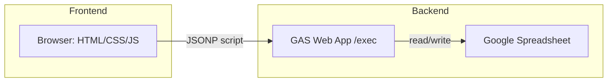
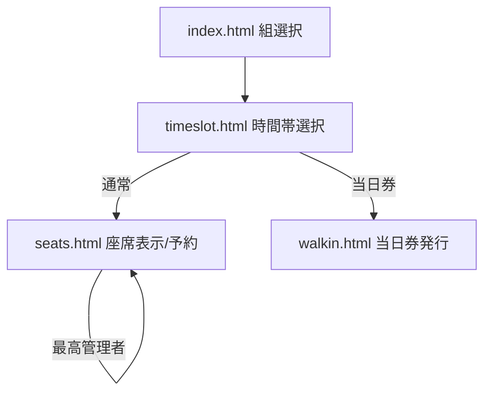
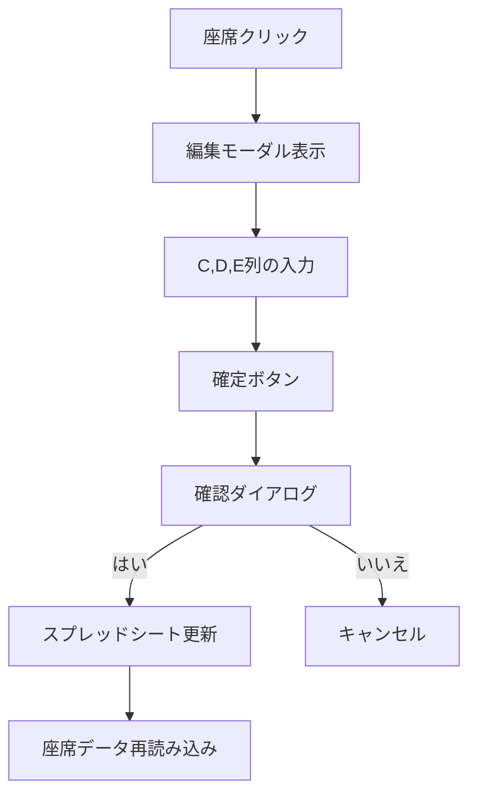

# チケット管理システム（座席予約・当日券発行・最高管理者機能）

このリポジトリは、文化祭やイベント向けの座席予約・チェックイン・当日券発行・最高管理者機能を行うシンプルな Web クライアントと、Google Apps Script（GAS）で構築されたバックエンドからなるシステムです。静的ホスティング可能なフロントエンド（HTML/CSS/JS）と、スプレッドシートをバックエンドとして使う運用に最適です。

## 主な機能
- 座席可視化と予約（通常モード）
- 予約済/確保/チェックイン待ち/チェックイン済のステータス表示
- 管理者モードでの複数席同時チェックイン
- 当日券モードでの空席自動割当（1〜6枚）
- **最高管理者モードでの座席データ編集（C、D、E列の自由編集）**
- サイドバーからのモード切り替え（通常/管理者/当日券/最高管理者）
- 自動更新（座席マップの定期リフレッシュ）と手動更新

## 動作モード（サイドバー > モード変更）
- **通常モード**: 座席予約が可能
- **管理者モード**: 予約済/確保席のチェックインが可能、座席名表示
- **当日券モード**: 空席の自動割当（1〜6席）
- **最高管理者モード**: 座席データのC、D、E列を自由に編集可能、座席名表示

管理者/当日券/最高管理者モードはパスワード認証が必要です（GAS のスクリプトプロパティに保存）。

## 画面構成
- `index.html`: 組選択ページ
- `timeslot.html`: 時間帯選択ページ
- `seats.html`: 座席選択・予約ページ（通常/管理者/最高管理者）
- `walkin.html`: 当日券発行ページ（当日券/管理者）

共通レイアウト/部品
- `styles.css`: 全体スタイル
- `sidebar.js` / `sidebar.css`: サイドバー、モード切替モーダル

機能別
- `seats-main.js` / `seats.css`: 座席マップ表示・予約・チェックイン・最高管理者編集
- `walkin-main.js` / `walkin.css`: 当日券発行、枚数選択（±ボタン対応）
- `timeslot-main.js` / `timeslot-schedules.js`: 時間帯選択（フロント固定データ）

バックエンド（GAS）
- `Code.gs`: API ルーター（doGet/doPost/JSONP 応答含む）と座席・予約・チェックイン・当日券・最高管理者編集処理
- `TimeSlotConfig.gs`: 時間帯設定（GAS 側）
- `SpreadsheetIds.gs`: 各公演のスプレッドシート ID 管理
- `system-setting.gs`: パスワード設定ユーティリティ（最高管理者パスワード含む）

## 最高管理者モードの詳細機能

### 権限と表示
- 管理者モードと同様に座席に名前が表示される
- ヘッダーに「最高管理者モード」の表示（濃い赤色）
- 座席にC、D、E列の情報も表示（小さなフォントで）

### 座席編集機能
- 任意の座席をクリックすると座席データ編集モーダルが表示
- C、D、E列の内容を自由に編集可能
- 確定ボタンを押すと「本当に変更しますか？」の確認ダイアログが表示
- 「はい」を押すとスプレッドシートが更新される
- 編集後は座席データが自動再読み込みされる

### セキュリティ
- `SUPERADMIN_PASSWORD`によるパスワード認証
- ロック機能による同時編集の防止
- スプレッドシートの直接更新（C、D、E列のみ）

## アーキテクチャ概要
- フロントは静的ファイル群（HTML/CSS/ES Modules）。ビルド不要。
- バックエンドは GAS を JSONP で呼び出し（`api.js`）。CORS を回避しつつ、`callback` で応答を受け取ります。
- データストアは Google スプレッドシート。`SpreadsheetIds.gs` で対象スプレッドシートを公演別に切替。
- 最高管理者モードでは座席データの直接編集が可能。

## セットアップ手順
1) スプレッドシート準備
- 各公演（組/日/時間帯）に対応するスプレッドシートを用意し、座席シート名は `Seats` に統一。
- 列レイアウト（`Code.gs` の参照範囲に一致）
  - A列: 行ラベル（A〜E）
  - B列: 列番号（1〜12、E は 1〜6）
  - C列: ステータス（`空`/`確保`/`予約済`）
  - D列: 予約名（任意）
  - E列: チェックイン（`済` のみ使用）

2) GAS デプロイ
- Google Apps Script プロジェクトを作成し、`Code.gs` / `TimeSlotConfig.gs` / `SpreadsheetIds.gs` / `system-setting.gs` を貼り付け。
- `SpreadsheetIds.gs` の `SEAT_SHEET_IDS` を公演ごとに正しい ID へ更新。
- `system-setting.gs` の `setupPasswords()` を一度実行して、`ADMIN_PASSWORD` / `WALKIN_PASSWORD` / `SUPERADMIN_PASSWORD` を設定（必要に応じて値を変更）。
- ウェブアプリとしてデプロイ。
  - 実行する関数: `doGet`
  - アクセス権: 全員（匿名含む）/組織内など、運用ポリシーに合わせて設定
- デプロイ URL を控えておきます。

3) フロント設定
- `config.js` の `GAS_API_URL` を上記デプロイ URL に設定。
- ローカル開発時は、任意の静的サーバーで `index.html` を開いて動作確認できます。

## 使い方
1) 組選択（`index.html`）
- 組を選ぶと `timeslot.html?group=1` のように遷移します。

2) 時間帯選択（`timeslot.html`）
- 組に紐づく時間帯を表示（`timeslot-schedules.js` を参照）。選択するとモードに応じてページ遷移：
  - 通常: `seats.html?group=1&day=1&timeslot=A`
  - 当日券: `walkin.html?group=1&day=1&timeslot=A`
  - URL に `admin=true` が付与されている場合は管理者コンテキストが引き継がれます。

3) 座席ページ（`seats.html`）
- **通常モード**: 空席を選択し「この席で予約する」。予約後はステータスが更新されます。
- **管理者モード**: 予約済/確保席が選択可能となり、複数選択して「チェックイン」を実行可能。
- **最高管理者モード**: 任意の座席をクリックしてC、D、E列のデータを編集可能。
- 自動更新: 30秒ごと（ユーザー操作時は一時停止）。手動更新ボタンもあり。

4) 当日券ページ（`walkin.html`）
- 枚数（1〜6）を ± ボタンまたは入力で指定し、「空席を探して当日券を発行する」。
- 空席があれば自動で確保し、割当席（単数/複数）を画面表示します。

## 設定とカスタマイズ
- API エンドポイント: `config.js` の `GAS_API_URL`
- デバッグログ: `config.js` の `DEBUG_MODE`
- 時間帯設定（フロント）: `timeslot-schedules.js` の `TIMESLOT_SCHEDULES`
- 時間帯設定（GAS）: `TimeSlotConfig.gs`（`_getAllTimeslotsForGroup` 経由で API 提供）
- スプレッドシート ID: `SpreadsheetIds.gs` の `SEAT_SHEET_IDS` / `LOG_SHEET_IDS`
- サイドバー/モード UI: `sidebar.js` / `sidebar.css`
- 座席レイアウト: `seats-main.js` の `layout`（行/列/通路位置など）
- 座席スタイル: `seats.css`（色、サイズ、凡例など）
- 当日券の枚数 UI: `walkin.css`（`walkin-qty-*` クラス）
- 最高管理者モード: `seats-main.js` の座席編集機能、`seats.css` のスタイル

変更のヒント
- 席行列構成を変える場合は、GAS 側の `isValidSeatId()`（行の最大席数）と、フロントの `layout`/描画に整合性を持たせてください。
- シート名を変更する場合は、`SpreadsheetIds.gs` の `TARGET_SEAT_SHEET_NAME` を合わせて変更します。
- モード認証の要件を変える場合は、`sidebar.js` の `applyModeChange()` と GAS 側 `verifyModePassword()` を調整します。
- 最高管理者モードの編集可能列を変更する場合は、`Code.gs` の `updateSeatData()` 関数を修正します。

## パラメータとリンク例
- 組: `group=1` または `group=見本演劇`
- 日: `day=1|2`
- 時間帯: `timeslot=A|B|C|D|E|F`
- 管理者: `admin=true`

例:
- `seats.html?group=1&day=1&timeslot=A`
- `walkin.html?group=見本演劇&day=1&timeslot=B`

## エラーハンドリング
- フロント `api.js` は JSONP 呼び出し失敗時に `_reportError()` を実行し、UI にエラー表示を試みます。
- GAS 側は try/catch と `LockService` により同時更新を保護します。
- 最高管理者モードの座席編集時も適切なエラーハンドリングが実装されています。

## 開発・デプロイのフロー
1. GAS を用意し、スプレッドシート ID とパスワードを設定、ウェブアプリとしてデプロイ。
2. `config.js` の `GAS_API_URL` を更新。
3. 任意の静的ホスティング（GitHub Pages など）にフロントを配置。

ローカル動作確認
- 簡易サーバーで OK（例: VS Code Live Server、`npx serve` など）。

## セキュリティ注意
- パスワードは GAS のスクリプトプロパティに保存。リポジトリに平文で置かない。
- 公開レベルは運用方針に従って最小権限にする。
- 最高管理者モードは最も高い権限を持つため、適切なパスワード管理が重要です。

## ライセンス
- リポジトリの `LICENSE` を参照。

## ファイル一覧（要点）
- `index.html` / `index-main.js`: 組選択 + サイドバー読込
- `timeslot.html` / `timeslot-main.js` / `timeslot-schedules.js`: 時間帯選択（フロント固定データ）
- `seats.html` / `seats-main.js` / `seats.css`: 座席表示・予約・チェックイン・最高管理者編集
- `walkin.html` / `walkin-main.js` / `walkin.css`: 当日券発行
- `sidebar.js` / `sidebar.css`: サイドバーとモード切替
- `api.js` / `config.js`: GAS API 呼び出し（JSONP）と設定
- `Code.gs` / `TimeSlotConfig.gs` / `SpreadsheetIds.gs` / `system-setting.gs`: GAS 側ロジック

---

## 最近の変更点（ハイライト）
- **最高管理者モードの追加**: 座席データのC、D、E列を自由に編集可能
- Walk-in（当日券）枚数選択UIを大型化（±ボタン）し、再入ガードで誤操作防止
- 複数席割当の失敗時に単発APIへ自動フォールバック（堅牢性向上）
- JSONP クライアント強化（タイムアウト/キャッシュバスター/成功時タイマー解除/詳細ログ/フェイルオーバーURL）
- サイドバーをオーバーレイ表示に変更（背景暗転、外側クリック/×で閉じる）
- モード変更（verifyModePassword）の二重送信防止（変更中はボタン/入力を無効化）
- すべてのページに favicon を追加

## 最高管理者モードの技術実装詳細

### フロントエンド（seats-main.js）
- `handleSuperAdminSeatClick()`: 最高管理者モードでの座席クリック処理
- `showSeatEditModal()`: 座席編集モーダルの表示
- `updateSeatData()`: 座席データの更新処理
- 座席表示にC、D、E列の情報を追加表示

### バックエンド（Code.gs）
- `updateSeatData()`: 座席データの更新処理（C、D、E列）
- `verifyModePassword()`: 最高管理者パスワードの検証
- ロック機能による同時編集の防止

### API（api.js）
- `updateSeatData()`: 座席データ更新用のAPI関数

### 設定（system-setting.gs）
- `setupSuperAdminPassword()`: 最高管理者パスワードの設定
- `changeSuperAdminPassword()`: パスワードの変更
- `checkPasswords()`: 全パスワードの確認

## 依存関係
- ブラウザ（Chromium/Firefox/Safari/Edge）
- Google Apps Script（Web アプリとしてデプロイ）
- Google スプレッドシート
- 静的ホスティング（GitHub Pages など）

## 仕組み（詳細）
- JSONP 通信: `api.js` が `<script>` を生成し、`callback` で応答を受け取ります。
  - 15s タイムアウト、キャッシュバスター、成功時はタイマー解除
  - 失敗時は `GAS_API_URLS` の次URLに自動フェイルオーバー
- Walk-in 発行: `walkin-main.js`
  - 再入防止フラグで多重実行を抑止
  - 複数席API失敗時は単発APIを複数回呼ぶフォールバック
- サイドバー: `sidebar.js`
  - オーバーレイで重ね表示、背景暗転
  - 外側クリック/×で閉じる
  - モード変更時は二重送信防止（処理中はボタン/入力を無効化）
- 最高管理者モード: `seats-main.js`
  - 座席クリックで編集モーダル表示
  - C、D、E列のデータ編集
  - スプレッドシートへの直接更新

## 図解
アーキテクチャ（概念）


ページ遷移


最高管理者モードの処理フロー


## 操作方法（補足）
- サイドバー: 画面左上のメニューで開閉。開いている間は背景が暗転。外側クリックまたは「×」で閉じる。
- モード変更: サイドバー内「モード変更」。処理中はボタン/入力が無効化されます。
- 当日券発行: ± ボタンで枚数調整（1〜6）。処理中は二重実行されません。
- **最高管理者モード**: 任意の座席をクリックして編集モーダルを開く。C、D、E列の内容を編集して確定。

## 設定のポイント（再掲）
- `config.js` の `GAS_API_URL` に最新の /exec URL を設定
- 予備 URL がある場合は `GAS_API_URLS` に追加（順番に試行）
- `system-setting.gs` の `setupPasswords()` で全パスワードを設定

## トラブルシューティング（再掲）
- JSONP タイムアウト
  - GAS の公開設定が「全員（匿名）」になっているか
  - 最新の /exec を `config.js` に設定（必要に応じて `GAS_API_URLS` に追加）
  - 疎通テスト: `https://<GAS>/exec?callback=cb&func=testApi&params=%5B%5D` を開く前に `function cb(x){console.log(x)}` を定義
- verifyModePassword の多重呼び出し
  - 二重送信防止済み。古いキャッシュならハードリロード
- Walk-in の二重発行
  - 再入防止済み。最新に更新して再試行
- 最高管理者モードで座席編集できない
  - `SUPERADMIN_PASSWORD` が正しく設定されているか確認
  - `system-setting.gs` の `checkPasswords()` で確認
  - スプレッドシートの権限設定を確認

## 最高管理者モードの使用例

### 1. パスワード設定
```javascript
// GASエディタで実行
setupSuperAdminPassword(); // デフォルト: superadmin
// または
changeSuperAdminPassword('mySecurePassword'); // カスタムパスワード
```

### 2. 座席データ編集
1. サイドバーから「モード変更」を選択
2. 「最高管理者モード」を選択し、パスワードを入力
3. 任意の座席をクリック
4. C、D、E列の内容を編集
5. 「確定」ボタンを押す
6. 確認ダイアログで「はい」を選択
7. スプレッドシートが更新される

### 3. 編集可能な列
- **C列**: ステータス（空、確保、予約済など）
- **D列**: 予約名や備考
- **E列**: チェックイン状態やその他の情報

## セキュリティベストプラクティス
- 最高管理者パスワードは強力なパスワードを使用
- 定期的にパスワードを変更
- 必要最小限のユーザーのみに最高管理者権限を付与
- ログの監視と異常な編集の検知
- バックアップの定期取得
