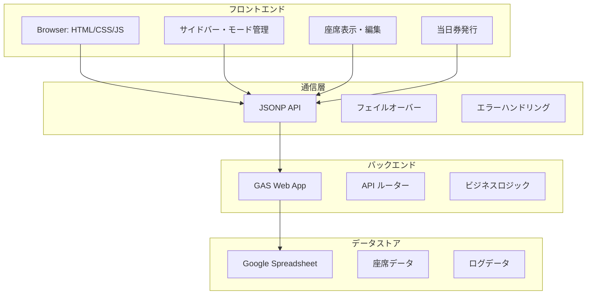
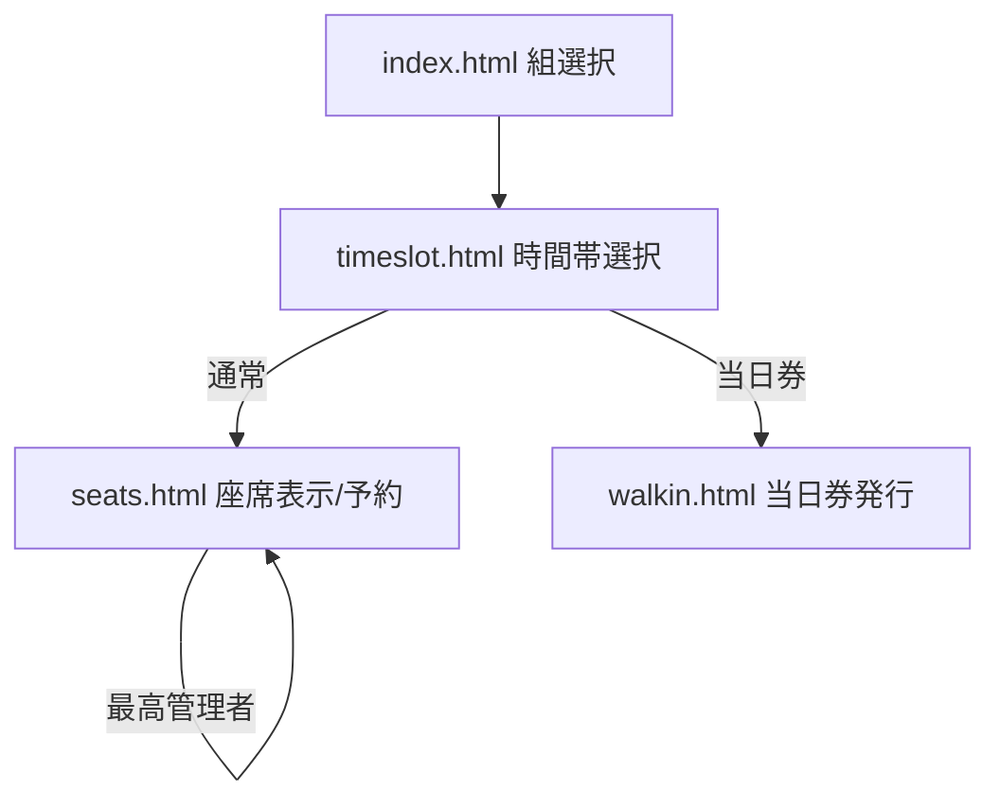
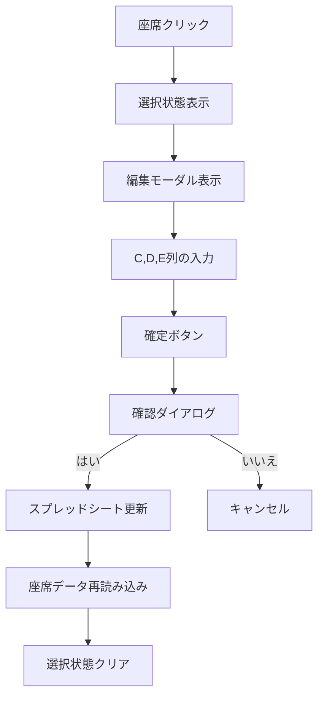
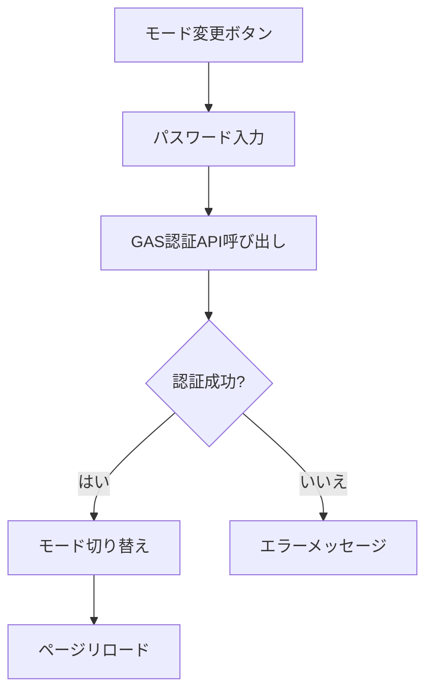

# チケット管理システム（座席予約・当日券発行・最高管理者機能）

このリポジトリは、文化祭やイベント向けの座席予約・チェックイン・当日券発行・最高管理者機能を行うシンプルな Web クライアントと、Google Apps Script（GAS）で構築されたバックエンドからなるシステムです。静的ホスティング可能なフロントエンド（HTML/CSS/JS）と、スプレッドシートをバックエンドとして使う運用に最適です。

## 🚀 主な機能

### 基本機能
- **座席可視化と予約**（通常モード）
- **予約済/確保/チェックイン待ち/チェックイン済のステータス表示**
- **自動更新**（座席マップの定期リフレッシュ）と手動更新

### 管理者機能
- **管理者モード**：予約済/確保席の複数席同時チェックイン
- **当日券モード**：空席の自動割当（1〜6枚）
- **最高管理者モード**：座席データのC、D、E列を自由に編集可能

### モード管理
- **サイドバーからのモード切り替え**（通常/管理者/当日券/最高管理者）
- **パスワード認証**によるセキュリティ
- **リアルタイムモード表示**

## 🎯 動作モード（サイドバー > モード変更）

| モード | 権限 | 機能 | 認証 |
|--------|------|------|------|
| **通常モード** | 一般ユーザー | 座席予約が可能 | 不要 |
| **管理者モード** | 管理者 | チェックイン、座席名表示 | パスワード必要 |
| **当日券モード** | 当日券担当 | 空席自動割当、当日券発行 | パスワード必要 |
| **最高管理者モード** | 最高管理者 | 座席データ編集、当日券発行、全権限 | パスワード必要 |

## 🏗️ 画面構成

### メインページ
- `index.html`: 組選択ページ
- `timeslot.html`: 時間帯選択ページ
- `seats.html`: 座席選択・予約ページ（通常/管理者/最高管理者/当日券）
- `walkin.html`: 当日券発行ページ（当日券/最高管理者）

### 共通レイアウト/部品
- `styles.css`: 全体スタイル
- `sidebar.js` / `sidebar.css`: サイドバー、モード切替モーダル、ナビゲーション
- `system-lock.js`: システムロック機能（ページロック）

### 機能別ファイル
- `seats-main.js` / `seats.css`: 座席マップ表示・予約・チェックイン・最高管理者編集・当日券ナビゲーション
- `walkin-main.js` / `walkin.css`: 当日券発行、枚数選択（±ボタン対応）
- `timeslot-main.js` / `timeslot-schedules.js`: 時間帯選択（フロント固定データ）

### バックエンド（GAS）
- `Code.gs`: API ルーター（doGet/doPost/JSONP 応答含む）と座席・予約・チェックイン・当日券・最高管理者編集処理
- `TimeSlotConfig.gs`: 時間帯設定（GAS 側）
- `SpreadsheetIds.gs`: 各公演のスプレッドシート ID 管理
- `system-setting.gs`: パスワード設定ユーティリティ（最高管理者パスワード含む）

## 🔐 最高管理者モードの詳細機能

### 権限と表示
- 管理者モードと同様に座席に名前が表示される
- ヘッダーに「最高管理者モード」の表示（濃い赤色）
- 座席クリック時に視覚的フィードバック（濃い赤色で選択状態表示）

### 座席編集機能
- **任意の座席を選択可能**：ステータスに関係なく全ての座席をクリック可能
- **編集モーダル表示**：座席クリック時にC、D、E列の編集フォームが表示
- **列別編集**：
  - **C列**: ステータス（空、確保、予約済など）
  - **D列**: 予約名・備考
  - **E列**: チェックイン状態・その他
- **確認ダイアログ**：確定ボタンで「本当に変更しますか？」の確認
- **自動更新**：編集後は座席データが自動再読み込みされる

### セキュリティ
- `SUPERADMIN_PASSWORD`によるパスワード認証
- ロック機能による同時編集の防止
- スプレッドシートの直接更新（C、D、E列のみ）

### 視覚的フィードバック
- 選択された座席は濃い赤色（#8B0000）で表示
- 白いボーダーと影で視認性を向上
- 単一選択（他の座席の選択は自動クリア）

## 🏛️ アーキテクチャ概要

### フロントエンド
- 静的ファイル群（HTML/CSS/ES Modules）。ビルド不要。
- モジュラー設計で機能別にファイルを分割
- レスポンシブデザイン対応
- **システムロック機能**
  - ページロックによるセキュリティ
  - リアルタイムロック状態監視

### バックエンド
- GAS を JSONP で呼び出し（`api.js`）
- CORS を回避しつつ、`callback` で応答を受け取ります
- フェイルオーバー機能で複数URLに対応

### データストア
- Google スプレッドシート
- `SpreadsheetIds.gs` で対象スプレッドシートを公演別に切替
- 最高管理者モードでは座席データの直接編集が可能

## 📋 セットアップ手順

### 1. スプレッドシート準備
- 各公演（組/日/時間帯）に対応するスプレッドシートを用意
- 座席シート名は `Seats` に統一
- 列レイアウト（`Code.gs` の参照範囲に一致）
  - **A列**: 行ラベル（A〜E）
  - **B列**: 列番号（1〜12、E は 1〜6）
  - **C列**: ステータス（`空`/`確保`/`予約済`）
  - **D列**: 予約名（任意）
  - **E列**: チェックイン（`済` のみ使用）

### 2. GAS デプロイ
- Google Apps Script プロジェクトを作成
- `Code.gs` / `TimeSlotConfig.gs` / `SpreadsheetIds.gs` / `system-setting.gs` を貼り付け
- `SpreadsheetIds.gs` の `SEAT_SHEET_IDS` を公演ごとに正しい ID へ更新
- `system-setting.gs` の `setupPasswords()` を一度実行して、全パスワードを設定
- ウェブアプリとしてデプロイ
  - 実行する関数: `doGet`
  - アクセス権: 全員（匿名含む）/組織内など、運用ポリシーに合わせて設定
- デプロイ URL を控えておきます

### 3. フロント設定
- `config.js` の `GAS_API_URL` を上記デプロイ URL に設定
- ローカル開発時は、任意の静的サーバーで `index.html` を開いて動作確認

## 🎮 使い方

### 1. 組選択（`index.html`）
- 組を選ぶと `timeslot.html?group=1` のように遷移

### 2. 時間帯選択（`timeslot.html`）
- 組に紐づく時間帯を表示（`timeslot-schedules.js` を参照）
- 選択するとモードに応じてページ遷移：
  - 通常: `seats.html?group=1&day=1&timeslot=A`
  - 当日券: `walkin.html?group=1&day=1&timeslot=A`
  - URL に `admin=true` が付与されている場合は管理者コンテキストが引き継がれます

### 3. 座席ページ（`seats.html`）
- **通常モード**: 空席を選択し「この席で予約する」。予約後はステータスが更新されます
- **管理者モード**: 予約済/確保席が選択可能となり、複数選択して「チェックイン」を実行可能
- **最高管理者モード**: 任意の座席をクリックしてC、D、E列のデータを編集可能
- 自動更新: 30秒ごと（ユーザー操作時は一時停止）。手動更新ボタンもあり

### 4. 当日券ページ（`walkin.html`）
- 枚数（1〜6）を ± ボタンまたは入力で指定し、「空席を探して当日券を発行する」
- 空席があれば自動で確保し、割当席（単数/複数）を画面表示します

## ⚙️ 設定とカスタマイズ

### 基本設定
- **API エンドポイント**: `config.js` の `GAS_API_URL`
- **デバッグログ**: `config.js` の `DEBUG_MODE`
- **フェイルオーバーURL**: `config.js` の `GAS_API_URLS`

### 機能別設定
- **時間帯設定（フロント）**: `timeslot-schedules.js` の `TIMESLOT_SCHEDULES`
- **時間帯設定（GAS）**: `TimeSlotConfig.gs`（`_getAllTimeslotsForGroup` 経由で API 提供）
- **スプレッドシート ID**: `SpreadsheetIds.gs` の `SEAT_SHEET_IDS` / `LOG_SHEET_IDS`
- **サイドバー/モード UI**: `sidebar.js` / `sidebar.css`
- **座席レイアウト**: `seats-main.js` の `layout`（行/列/通路位置など）
- **座席スタイル**: `seats.css`（色、サイズ、凡例など）
- **当日券の枚数 UI**: `walkin.css`（`walkin-qty-*` クラス）
- **最高管理者モード**: `seats-main.js` の座席編集機能、`seats.css` のスタイル

### 変更のヒント
- 席行列構成を変える場合は、GAS 側の `isValidSeatId()`（行の最大席数）と、フロントの `layout`/描画に整合性を持たせてください
- シート名を変更する場合は、`SpreadsheetIds.gs` の `TARGET_SEAT_SHEET_NAME` を合わせて変更します
- モード認証の要件を変える場合は、`sidebar.js` の `applyModeChange()` と GAS 側 `verifyModePassword()` を調整します
- 最高管理者モードの編集可能列を変更する場合は、`Code.gs` の `updateSeatData()` 関数を修正します

## 🔗 パラメータとリンク例

### 基本パラメータ
- **組**: `group=1` または `group=見本演劇`
- **日**: `day=1|2`
- **時間帯**: `timeslot=A|B|C|D|E|F`
- **管理者**: `admin=true`

### リンク例
- `seats.html?group=1&day=1&timeslot=A`
- `walkin.html?group=見本演劇&day=1&timeslot=B`
- `seats.html?group=2&day=2&timeslot=C&admin=true`

## 🛡️ エラーハンドリング

### フロントエンド
- `api.js` は JSONP 呼び出し失敗時に `_reportError()` を実行
- UI にエラー表示を試みる
- フェイルオーバー機能で複数URLに対応

### バックエンド
- GAS 側は try/catch と `LockService` により同時更新を保護
- 最高管理者モードの座席編集時も適切なエラーハンドリングが実装されています
- ロック機能による同時編集の防止

## 🚀 開発・デプロイのフロー

### 1. 初期セットアップ
1. GAS を用意し、スプレッドシート ID とパスワードを設定
2. ウェブアプリとしてデプロイ
3. `config.js` の `GAS_API_URL` を更新

### 2. フロントエンド配置
- 任意の静的ホスティング（GitHub Pages など）にフロントを配置

### ローカル動作確認
- 簡易サーバーで OK（例: VS Code Live Server、`npx serve` など）

## 🔒 セキュリティ注意

### パスワード管理
- パスワードは GAS のスクリプトプロパティに保存
- リポジトリに平文で置かない
- 公開レベルは運用方針に従って最小権限にする

### 最高管理者モード
- 最高管理者モードは最も高い権限を持つため、適切なパスワード管理が重要です
- 強力なパスワードの使用
- 定期的なパスワード変更
- 必要最小限のユーザーのみに権限を付与

## 📄 ライセンス
- リポジトリの `LICENSE` を参照

## 📁 ファイル一覧（要点）

### フロントエンド
- `index.html` / `index-main.js`: 組選択 + サイドバー読込
- `timeslot.html` / `timeslot-main.js` / `timeslot-schedules.js`: 時間帯選択（フロント固定データ）
- `seats.html` / `seats-main.js` / `seats.css`: 座席表示・予約・チェックイン・最高管理者編集
- `walkin.html` / `walkin-main.js` / `walkin.css`: 当日券発行

### 共通・設定
- `sidebar.js` / `sidebar.css`: サイドバーとモード切替
- `api.js` / `config.js`: GAS API 呼び出し（JSONP）と設定
- `styles.css`: 全体スタイル

### バックエンド（GAS）
- `Code.gs` / `TimeSlotConfig.gs` / `SpreadsheetIds.gs` / `system-setting.gs`: GAS 側ロジック

---

## 🆕 最近の変更点（ハイライト）

### PWA機能の削除と通常WEBアプリ化
- **PWA関連ファイルの削除**: manifest.json、sw.js、pwa.js、pwa.css、offline.htmlを削除
- **システムロック機能の独立**: ページロック機能をsystem-lock.jsとして分離
- **通常WEBアプリとして稼働**: PWA機能なしで標準的なWEBアプリケーションとして動作

### チェックイン速度の最適化
- **楽観的更新**: チェックイン・予約後に即座にUIを更新し、ユーザー体験を向上
- **バックグラウンド更新**: ステータス更新をバックグラウンドでサイレントに実行
- **非ブロッキング通知**: alert()を非ブロッキングの通知システムに置き換え
- **即座のUI反応**: ユーザー操作に対する即座の視覚的フィードバック

### 通信高速化の最適化
- **データ取得の最適化**: 必要な列のみ取得（A, C, D列 vs A, C列）
- **最小限データAPI**: `getSeatDataMinimal`でステータスのみ取得
- **バッチ処理の改善**: 複数座席の一括更新で処理効率化
- **レスポンスサイズ削減**: 不要なデータの除外で通信量削減
- **自動更新の最適化**: 通常モードでは最小限データ、管理者モードでは完全データ

### 最高管理者モードの追加
- **座席データ編集**: C、D、E列を自由に編集可能
- **視覚的フィードバック**: 座席選択時の濃い赤色表示
- **セキュリティ強化**: パスワード認証とロック機能

### 既存機能の改善
- Walk-in（当日券）枚数選択UIを大型化（±ボタン）し、再入ガードで誤操作防止
- 複数席割当の失敗時に単発APIへ自動フォールバック（堅牢性向上）
- JSONP クライアント強化（タイムアウト/キャッシュバスター/成功時タイマー解除/詳細ログ/フェイルオーバーURL）
- サイドバーをオーバーレイ表示に変更（背景暗転、外側クリック/×で閉じる）
- モード変更（verifyModePassword）の二重送信防止（変更中はボタン/入力を無効化）
- すべてのページに favicon を追加

### デバッグ・トラブルシューティング
- GAS疎通テスト機能の追加
- 詳細なエラーログとエラー報告
- フェイルオーバー機能の強化

## 🔧 最高管理者モードの技術実装詳細

### フロントエンド（seats-main.js）
- `handleSuperAdminSeatClick()`: 最高管理者モードでの座席クリック処理
- `showSeatEditModal()`: 座席編集モーダルの表示
- `updateSeatData()`: 座席データの更新処理
- 座席選択状態の視覚的フィードバック

### バックエンド（Code.gs）
- `updateSeatData()`: 座席データの更新処理（C、D、E列）
- `verifyModePassword()`: 最高管理者パスワードの検証
- ロック機能による同時編集の防止
- 座席ID検索ロジックの最適化

### API（api.js）
- `updateSeatData()`: 座席データ更新用のAPI関数
- `testGASConnection()`: GAS疎通テスト用の関数
- エラーハンドリングの改善

### 設定（system-setting.gs）
- `setupSuperAdminPassword()`: 最高管理者パスワードの設定
- `changeSuperAdminPassword()`: パスワードの変更
- `checkPasswords()`: 全パスワードの確認

## 📊 依存関係

### フロントエンド依存
- **ブラウザ**: Chromium/Firefox/Safari/Edge（ES6+対応）
- **HTML5**: セマンティックHTML、フォーム要素
- **CSS3**: Flexbox、Grid、アニメーション
- **JavaScript**: ES6+ Modules、Async/Await、Promise

### バックエンド依存
- **Google Apps Script**: Web アプリとしてデプロイ
- **Google スプレッドシート**: データストア
- **Google サービス**: PropertiesService、LockService、SpreadsheetApp

### 外部依存
- **静的ホスティング**: GitHub Pages、Netlify、Vercelなど
- **CDN**: 必要に応じて外部リソース

## 🔄 仕組み（詳細）

### JSONP 通信
- `api.js` が `<script>` を生成し、`callback` で応答を受け取ります
- 15s タイムアウト、キャッシュバスター、成功時はタイマー解除
- 失敗時は `GAS_API_URLS` の次URLに自動フェイルオーバー

### Walk-in 発行
- `walkin-main.js`
- 再入防止フラグで多重実行を抑止
- 複数席API失敗時は単発APIを複数回呼ぶフォールバック

### サイドバー
- `sidebar.js`
- オーバーレイで重ね表示、背景暗転
- 外側クリック/×で閉じる
- モード変更時は二重送信防止（処理中はボタン/入力を無効化）

### 最高管理者モード
- `seats-main.js`
- 座席クリックで編集モーダル表示
- C、D、E列のデータ編集
- スプレッドシートへの直接更新
- 視覚的フィードバックと選択状態管理

## 📈 図解

### システムアーキテクチャ


### ページ遷移フロー


### 最高管理者モードの処理フロー


### モード認証フロー


## 🎮 操作方法（補足）

### サイドバー操作
- 画面左上のメニューで開閉
- 開いている間は背景が暗転
- 外側クリックまたは「×」で閉じる

### モード変更
- サイドバー内「モード変更」
- 処理中はボタン/入力が無効化されます
- パスワード認証が必要

### 当日券発行
- ± ボタンで枚数調整（1〜6）
- 処理中は二重実行されません

### 最高管理者モード
- 任意の座席をクリックして編集モーダルを開く
- C、D、E列の内容を編集して確定
- 確認ダイアログで「はい」を選択
- スプレッドシートが更新される

## ⚙️ 設定のポイント（再掲）

### 必須設定
- `config.js` の `GAS_API_URL` に最新の /exec URL を設定
- 予備 URL がある場合は `GAS_API_URLS` に追加（順番に試行）
- `system-setting.gs` の `setupPasswords()` で全パスワードを設定

### 推奨設定
- フェイルオーバーURLの設定
- デバッグモードの有効化（開発時）
- ログ監視の設定

## 🚨 トラブルシューティング（再掲）

### 一般的な問題
- **JSONP タイムアウト**
  - GAS の公開設定が「全員（匿名）」になっているか
  - 最新の /exec を `config.js` に設定（必要に応じて `GAS_API_URLS` に追加）
  - 疎通テスト: `https://<GAS>/exec?callback=cb&func=testApi&params=%5B%5D` を開く前に `function cb(x){console.log(x)}` を定義

- **verifyModePassword の多重呼び出し**
  - 二重送信防止済み。古いキャッシュならハードリロード

- **Walk-in の二重発行**
  - 再入防止済み。最新に更新して再試行

### 最高管理者モード特有の問題
- **座席編集できない**
  - `SUPERADMIN_PASSWORD` が正しく設定されているか確認
  - `system-setting.gs` の `checkPasswords()` で確認
  - スプレッドシートの権限設定を確認

- **編集モーダルが表示されない**
  - 最高管理者モードに正しくログインしているか確認
  - ブラウザのコンソールでエラーメッセージを確認

### GAS疎通テスト
- サイドバーの「GAS疎通テスト」ボタンを使用
- 詳細なエラー情報を確認
- 必要に応じて新しいデプロイURLを取得

## 📚 最高管理者モードの使用例

### 1. パスワード設定
```javascript
// GASエディタで実行
setupSuperAdminPassword(); // デフォルト: superadmin
// または
changeSuperAdminPassword('mySecurePassword'); // カスタムパスワード
```

### 2. 座席データ編集
1. サイドバーから「モード変更」を選択
2. 「最高管理者モード」を選択し、パスワードを入力
3. 任意の座席をクリック
4. C、D、E列の内容を編集
5. 「確定」ボタンを押す
6. 確認ダイアログで「はい」を選択
7. スプレッドシートが更新される

### 3. 編集可能な列
- **C列**: ステータス（空、確保、予約済など）
- **D列**: 予約名や備考
- **E列**: チェックイン状態やその他の情報

## 🔒 セキュリティベストプラクティス

### パスワード管理
- 最高管理者パスワードは強力なパスワードを使用
- 定期的にパスワードを変更
- 必要最小限のユーザーのみに最高管理者権限を付与

### アクセス制御
- ログの監視と異常な編集の検知
- バックアップの定期取得
- 権限の段階的管理

### 運用管理
- 定期的なセキュリティレビュー
- インシデント対応計画の策定
- ユーザートレーニングの実施

## 📊 パフォーマンス最適化

### フロントエンド
- 自動更新の最適化（30秒間隔）
- ユーザー操作中の自動更新停止
- 効率的なDOM操作

### バックエンド
- ロック機能による同時更新の制御
- 適切なタイムアウト設定
- エラーハンドリングの最適化

### データベース
- スプレッドシートの効率的な読み書き
- インデックスの最適化
- キャッシュ戦略

## 🔮 今後の拡張予定

### 機能拡張
- リアルタイム座席状況の表示
- 予約履歴の管理
- 統計・レポート機能

### 技術的改善
- WebSocket対応
- リアルタイム通信
- パフォーマンス最適化

### セキュリティ強化
- 多要素認証
- 監査ログ
- 暗号化通信

---

## 📞 サポート・フィードバック

### 問題報告
- GitHub Issues で問題を報告
- 詳細なエラーログと再現手順を記載

### 機能要望
- 新機能の提案は GitHub Discussions で
- ユースケースと期待する動作を記載

### ドキュメント改善
- READMEの改善提案も歓迎
- 分かりにくい部分の指摘

---

## 📄 ライセンス
- リポジトリの `LICENSE` を参照

## 🤝 コントリビューション
- プルリクエストを歓迎
- コーディング規約に従ってください
- テストの追加も推奨
